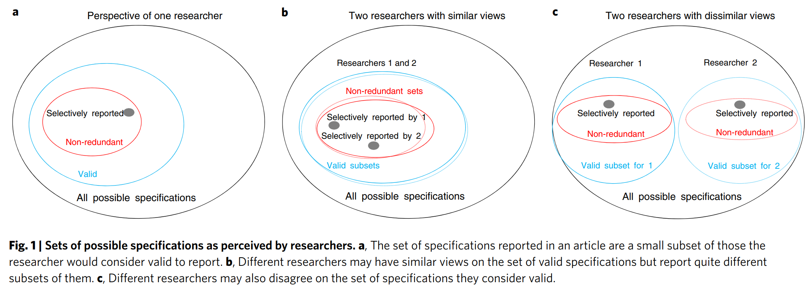
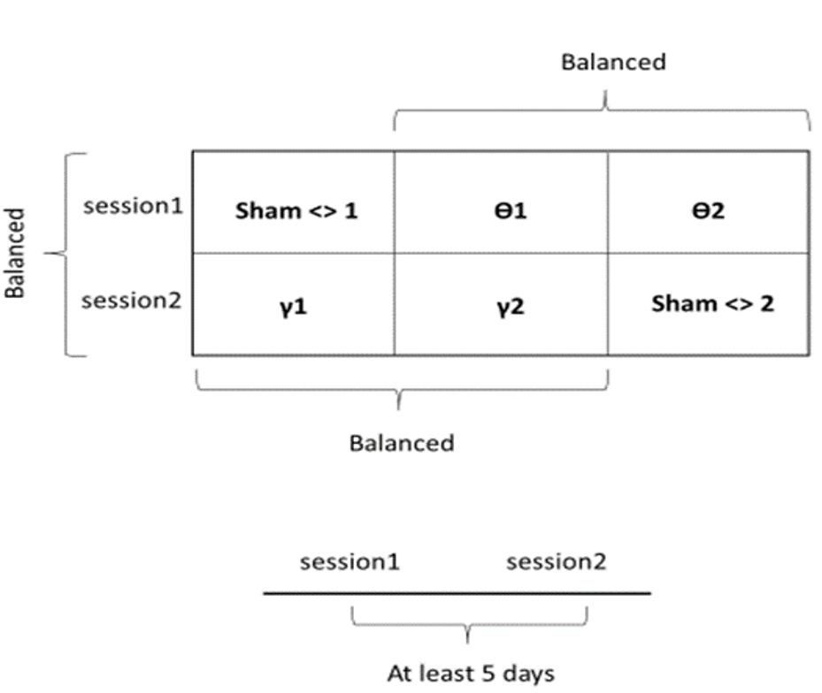

```{r setup, include=FALSE}
knitr::opts_chunk$set(echo = FALSE)

library(fontawesome)
library(DiagrammeR)
library(knitr)
library(afex)
library(reshape2)
library(ggplot2)
library(gridExtra)
```

## Some notes about myself {.smaller}

:::: {.columns}
:::: {.column width="20%"}
{width=80% height=80%}
::::
:::: {.column width="80%"}
- Associate Professor \@UniVR of Cognitive Neuroscience and Neuropsychology (PSIC01-B).
  - Body Representations (in Spinal Cord Injuries but not only).
  - Neuropsychology.
  - Space representations.
  - Bayesian Statistics (since 2011!).

- Secretary of the Italian Reproducibility Network (https://www.itrn.org/).
- Teaching Delegate - PhD Program in Human Sciences \@UniVR.
- Director of the BayesHSC summer school since 2019 (https://sites.hss.univr.it/bayeshsc/).
::::
::::


---


- **Body representations in Spinal Cord Injury**:
  - Body, action and space representations in people affected by spinal cord injuries [@scandola2022body].
  - Topographic mapping of the sensorimotor qualities of empathic reactivity: A psychophysiological study in people with SCI [@scandola2024topographic].
  - Embodying their own wheelchair modifies extrapersonal space perception in people with spinal cord injury [@scandola2019embodying].

- **Anosognosia**:
  - Anosognosia for limb and bucco‐facial apraxia as inferred from the recognition of gestural errors [@scandola2021anosognosia].
  - Anosognosia for hemiplegia as a tripartite disconnection syndrome [@pacella2019anosognosia].

- **Psychometrics**:
  - Bayesian multilevel single case models using ‘Stan’. A new tool to study single cases in neuropsychology [@scandola2021bayesian].
  - Reliability and feasibility of linear mixed models in fully crossed experimental designs [@scandola2024reliability].


## Introduction

- Two studies:
  * Study 1:
  Modulating preferences during intertemporal choices through exogenous midfrontal transcranial alternating current stimulation: A registered report [@fusco2024modulating].
  * Study 2:
  Impact of Transcranial Static Magnetic Stimulation on the Motor Cortex: a Revision and Replication Study [@gabelli2025impact].
 
## Open Science

::: center

:::

## Reproducibility crisis

::: center

:::


## Reproducibility crisis {.smaller}

::: center
```{r, fig.height=4}
dat <- data.frame(
  y = c(64, 36, 100-46, 46, 100 - 17, 17),
  x = c("Psychology", "Psychology",
        "Cancer Biology", "Cancer Biology",
        "SCI research", "SCI research"),
  type = c("Not replicated", "Replicated",
           "Not replicated", "Replicated",
           "Not replicated", "Replicated")
)

ggplot(data = subset(dat, x == "Psychology"),
       mapping = aes(x="", y=y, fill=type)) +
  geom_bar(stat="identity", width=1, color="white") +
  coord_polar("y", start=0) +
  facet_grid(~x)+
  theme_void()+
  scale_fill_brewer(palette = "Set1")+
  theme(legend.position = "bottom",
        legend.direction = "horizontal",
        legend.title = element_blank())
```
:::


The *Open Science Collaboration* in 2015 [@open2015estimating] was able to replicate the 36% out of 100 studies.


---

::: center
```{r, fig.height=4}
ggplot(data = subset(dat, x == "SCI research"), mapping = aes(x="", y=y, fill=type)) +
  geom_bar(stat="identity", width=1, color="white") +
  coord_polar("y", start=0) +
  facet_grid(~x)+
  theme_void()+
  scale_fill_brewer(palette = "Set1")+
  theme(legend.position = "bottom",
        legend.direction = "horizontal",
        legend.title = element_blank())
```
:::

The *FORE-SCI* project in 2012 [@steward2012replication] was able to replicate the 17% out of 12 studies.

---


::: center
```{r, fig.height=4}
ggplot(data = subset(dat, x == "Cancer Biology"),
       mapping = aes(x="", y=y, fill=type)) +
  geom_bar(stat="identity", width=1, color="white") +
  coord_polar("y", start=0) +
  facet_grid(~x)+
  theme_void()+
  scale_fill_brewer(palette = "Set1")+
  theme(legend.position = "bottom",
        legend.direction = "horizontal",
        legend.title = element_blank())
```
:::

The *Reproducibility Project: Cancer Biology* [@errington2021investigating] was able to replicate the 46% out of 112 studies.

## A question

::: center
* If I am _objective_,
* If I am employing state-of-the-art methods,
* If I am rigorously collecting data,
* If I am applying a correct statistical approach,
* Then, <span style="color:red;">why should I care about Open Science?</span>
:::

---

::: center
> 1. **If I am _objective_,**
> 2. If I am employing state-of-the-art methods,
> 3. If I am rigorously collecting data,
> 4. If I am applying a correct statistical approach,
> 5. Then, <span style="color:red;">why should I care about Open Science?</span>
:::


## "If I am _objective_"

::: center

:::

## "If I am _objective_"

> Somebody has to formulate the hypothesis, and conduct and
> interpret the experiment. <br>
> All of this is done by observers.<br>
> Most science is based on the assumption that you can remove the observer
> to get objective statements. <br>
> Without observers, there would be no science.

-- Stuart Umpleby

## "If I am _objective_"

::: center
{width="1200"}<br>[@simonsohn2020specification]
:::


---


::: center
> 1. ~~If I am _objective_,~~
> 2. **If I am employing state-of-the-art methods**,
> 3. If I am rigorously collecting data,
> 4. If I am applying a correct statistical approach,
> 5. Then, <span style="color:red;">why should I care about Open Science?</span>
:::

## "If I am employing state-of-the-art methods"

We want to determine whether, in post-stroke patients with neglect,<br>
high levels of anxiety are associated with more debilitating neglect.

```{r, echo=FALSE}
shinyApp(
  ui = fluidPage(
    fluidRow(
      column(width = 3, "How many groups?"),
      column(width = 3,
             textAreaInput("n_groups_1", "", "1", width = "500px")
      ),
      column(width = 3,
             textAreaInput("n_groups_2", "", "1", width = "500px")
      ),
      column(width = 3,
             textAreaInput("n_groups_3", "", "1", width = "500px")
      )
    ),
    fluidRow(
      column(width = 3, "Which test are we going to use to evaluate anxiety?"),
      column(width = 3,
             textAreaInput("anx_1", "", "STAI-Y", width = "500px")
      ),
      column(width = 3,
             textAreaInput("anx_2", "", "STAI-Y", width = "500px")
      ),
      column(width = 3,
             textAreaInput("anx_3", "", "STAI-Y", width = "500px")
      )
    ),
    fluidRow(
      column(width = 3, "How do we assess neglect?"),
      column(width = 3,
             textAreaInput("neg_1", "", "Bisection test", width = "500px")
      ),
      column(width = 3,
             textAreaInput("neg_2", "", "Bisection test", width = "500px")
      ),
      column(width = 3,
             textAreaInput("neg_3", "", "Bisection test", width = "500px")
      )
    ),
    actionButton("compute_button",
                 label = "How many different studies?",
                 class = "btn-success"),
    DT::DTOutput("results")
  ),

  server = function(input, output) {
    
    observeEvent(input$compute_button, {
      dat <- expand.grid(
        c(input$n_groups_1, input$n_groups_2, input$n_groups_3),
        c(input$anx_1, input$anx_2, input$anx_3),
        c(input$neg_1, input$neg_2, input$neg_3)
      )
      
      colnames(dat) <- c("Groups", "Anxiety", "Neglect")
      
      dat_txt <- matrix(nrow = 10, ncol = 5)
      ic <- ir <- 1
      for(rr in 1:nrow(dat)){
        dat_txt[ir, ic] <-
          paste(dat$Groups[rr], dat$Anxiety[rr], dat$Neglect[rr], sep = "\n")
        if(ic < 5){
          ic <- ic + 1
        } else {
          ic <- 1
          ir <- ir + 1
        }
      }
      
      dat_txt <- data.frame(dat_txt)
      
      output$results <- renderDataTable({
        dat_txt
      })
    })
  },

  options = list(height = 700)
)
```

---

::: center
> 1. ~~If I am _objective_,~~
> 2. ~~If I am employing state-of-the-art methods~~,
> 3. **If I am rigorously collecting data**,
> 4. If I am applying a correct statistical approach,
> 5. Then, <span style="color:red;">why should I care about Open Science?</span>
:::

## "If I am rigorously collecting data"

### Dance of p-values [@cumming2014new]

Simulation of 50 obervations with effect size Cohen's d = 0.5

```{r}
set.seed(1)

inputPanel(
  ## the data was actually generated before-hand
  actionButton("generate_button_2",
               label = "Generate the data.",
               class = "btn-success")
)

renderPlot({
  if( (input$generate_button_2) != 0 ){

    out <- list()
    
    for(i in 1:25){
      y <- rnorm(n = 50, mean = 0.5)
      
      p <- t.test(y)$p.value
      m <- mean(y)
      ci <- quantile(y, probs = c(0.025,0.975))
      
      out[[i]] <- data.frame(
        p       = p,
        m       = m,
        ci_low  = ci[1],
        ci_high = ci[2],
        i = i
      )
    }
    
    out <- do.call("rbind", out)
    
    ggplot(out, aes(y = m, ymin = ci_low, ymax = ci_high, x = i, colour = p < 0.05))+
      geom_pointrange()+
      geom_text(y = max(out$ci_high)+0.1, aes(x = i, label = round(p, 3)))+
      theme_bw()+
      coord_flip()+
      xlab("")+ylab("")+
      scale_color_brewer(palette = "Set1")
    }
  }
)

```


---

::: center
> 1. ~~If I am _objective_,~~
> 2. ~~If I am employing state-of-the-art methods~~,
> 3. ~~If I am rigorously collecting data~~,
> 4. **If I am applying a correct statistical approach**,
> 5. Then, <span style="color:red;">why should I care about Open Science?</span>
:::


## "If I am applying a correct statistical approach"

In analysing our data, we can follow one of four main approaches [@gelman2013garden]:

1.  `r fa("hourglass", fill = "grey")` Applying a unique statistical test on data.
2.  `r fa("medal", fill = "green")` Applying a pre-registered statistical test on data, pre-specifying all choices.
3.  `r fa("triangle-exclamation", fill = "orange")` Applying a statistical test on data, that would be different given a different data set (**Researcher's dof**)
4.  `r fa("skull-crossbones", fill = "red")` Applying all possible choices in data handling and statistical tests (the so-called **fishing**) 

---

### "If I am applying a correct statistical approach"

-   Data are not passively collected and analysed.
-   Removing outliers, transforming variables, choosing independent variables and<br>confounders are routine decisions for researchers.
-   From a single data set, we can have multiple processed data sets.
-   Researchers select a single (or a few) data processing choices and then present this as the only analysis that ever would have been done.
-   The inevitable arbitrariness in the data and the sensitivity of the result is hidden to the reader.

- [@steegen2016increasing]


## To summarise...

::: center
* ~~If I am _objective_~~ Because we fail to be objective,
* ~~If I am employing state-of-the-art methods~~ because my methodological choices have an impact on results,
* ~~If I am rigorously collecting data~~ because of data sampling variability,
* ~~If I am applying a correct statistical approach~~ because there are many accepted statistical approaches,
* Then, <span style="color:red;">**WE NEED OPEN SCIENCE**</span>
:::

# Study 1

## Modulating intertemporal choices through midfrontal tACS

::: center
{width=100% height=100%}
:::

[@fusco2024modulating]

## Theoretical Background and Previous Findings

### Conflict monitoring

- To reach optimal decisions, the brain requires efficient and specialised systems [@ullsperger2001subprocesses].
- Theoretical and computational models $\leftarrow$ ACC and MFC as hub-like regions for conflict and error monitoring [@botvinick2001conflict].
- Conflict and error processing $\leftarrow$ enhanced midfrontal $\theta$ oscillations (MF $\theta$ ) [@cavanagh2014frontal]
- Applying $\theta$ tACS to midfrontal areas fasten the decisional process [@fusco2018midfrontal].

## Theoretical Background and Previous Findings

### Transcranial Alternate Current Stimulation (tACS)

::: center

:::
[@wischnewski2023neurocognitive]


## Research Questions

1. investigate whether MF$\theta$ impact conflict processing.
2. explore behavioural carry-over effects.
- we wanted to be as robust and transparent as possible $\rightarrow$ *Registered Report* .

## Registered Report

**Definition**  

A **Registered Report** is a type of scientific article in which the **study rationale and methods are peer-reviewed before data collection begins**.

::: center

{width=70% height=70%}

:::

## Registered Report

**Purpose:**

- Reduces **publication bias**.
- Promotes **transparency** and **reproducibility**.
- Encourages stronger **study design** through early feedback.

## Registered Report

- **Stage 1: Before Data Collection**
  - Submit **Introduction, Methods, and Proposed Analyses**.
  - Peer-reviewed for:
    - **Theoretical importance**.
    - **Rigor and feasibility**.
  - If accepted: receive **In-Principle Acceptance (IPA)**.

- **Stage 2: After Data Collection**
  - Submit **Results and Discussion**.
  - Review checks whether:
    - The protocol was followed.
    - Conclusions are supported by data.
  - Results **cannot be rejected** based on outcome alone.
  
> **Key Benefit:**  
> Protects against p-hacking, HARKing, and selective reporting.

## Procedure

### Stage 1

To test the procedure and methodology and calculate the effect size to estimate the sample size for the study, we performed a PILOT STUDY.

- 14 healthy participants (F = 5; age = $24.86 \pm 2.13$) received tACS during the TD where we manipulated the conflict level associated with rewards (low, medium, high).

<table>
<tr>
<td width = 50%>
{width=80%}
</td>
<td width = 50%>
{width=80%}
</td>
</tr>
</table>

---

### Temporal Discounting Task

::: center


[@ainslie1975specious]
[@critchfield2001temporal]

:::

---

::: center

{width="500"}

[@ainslie1975specious]
[@critchfield2001temporal]

:::

---

### Flanker Task

**Definition:**  

A **Flanker Task** is a psychological test used to measure **attention** and **inhibitory control**. It assesses how well a person can resist interference from **distracting stimuli** (_flankers_) surrounding a target.

- **How it works:**
  - Participants respond to a **central target stimulus**.
  - Target is flanked by **congruent** or **incongruent** stimuli.
  - Example:
    - **Congruent:** HH**H**HH
    - **Incongruent:** SS**H**SS

- **Key Metrics:**
  - **Reaction Time (RT)**: Slower in incongruent trials.
  - **Accuracy**: Often lower when flanking stimuli conflict.
  - **Post Error Slowing** (PES): $PES = RT_{\text{post error}} - RT_{\text{pre error}}$ [@damaso2020evidence].
  
---

### Bayesian Multilevel Linear Models

::: center

{width=60% height=60%}

:::

---


<table>
<tr>
<td width = 50%>
{width=80%}
</td>
<td width = 50%>
{width=80%}
</td>
</tr>
</table>

---

### Statistical Analysis

Bayesian Generalised Multilevel Linear Models on:

- Temporal Discounting
  - $\ln(\text{RT})$
  - Choices (1 = delayed; 0 = immediate)
  
- Flanker Task
  - $\ln(\text{RT})$
  - Accuracies (1 = correct; 0 = wrong)
  - PES [@damaso2020evidence]

---

::: center

{width=100% height=100%}

:::

## Results

### Stage 2

<table>
<tr>
<td width = 50%>
{height=20%}
</td>
<td width = 50%>
{height=20%}
</td>
</tr>
</table>

Unexpectedly, both $\theta$ and $\gamma$ driven neuromodulation speeded-up decisions compared to sham. 

- Exploratory analyses;
  - When RT effects were normalized to sham, $\theta$ tACS had stronger RT effects than $\gamma$ tACS only in high-conflict trials.
  - Association between Attentional Impulsiveness (BIS11) and choices during $\theta$ tACS stimulation.

## Conclusions

- Both $\theta$ and $\gamma$ tACS speed up decisions, but only $\theta$ appears to enhance processing in high-conflict scenarios, aligning with its role in conflict monitoring.
  - $\theta \rightarrow$ conflict monitoring (?).
  - $\gamma \rightarrow$ attentional control, abstract reasoning and working memory [@howard2003gamma] [@taylor2022longitudinal] (?).
- No support for tACS (either frequency) influencing preference outcomes (e.g., choices).
- Individual differences (e.g., attentional impulsiveness) may modulate theta-tACS effects, especially in high-conflict trials.

# Study 2

## Impact of Transcranial Static Magnetic Stimulation on the Motor Cortex: a Revision and Replication Study

::: center

<table>
<tr>
<td>
{width=500px}
</td>
</tr>
<tr>
<td>
{width=500px}
</td>
</tr>
</table>

Authors: Bjekic Jovana, Cattaneo Luigi, Dukic Bojana, Gabelli Cecilia, Manojlovic Milica, Miniussi Carlo, Scandola Michele. (in alphabetical order)

[@gabelli2025impact]

:::

## Theoretical Background and Previous Findings

### transcranial Static Magnetic field Stimulation (tSMS)

::: center

{width=500px}

[@pagge2024transcranial]
[@oliviero2011transcranial]

:::

---

|     **Paper**                    |                          |     **d **   |     **$\mid d \mid$**|**$\sigma$** | **duration**    |
|----------------------------------|--------------------------|--------------|--------------|-------------|-----------------|
|     Silbert et al., 2013         |                          |     0,54     |     0,54     |     0,21    |     15          |
|     Dileone et al., 2018         |     Exp   1              |     -0,31    |     0,31     |     0,20    |     30          |
|                                  |     Exp   2              |     -0,30    |     0,30     |     0,20    |     30          |
|     Davila-Pérez et al., 2019    |     pre-intervention     |     0,07     |     0,07     |     0,08    |     15          |
|                                  |     post-intervention    |     0,21     |     0,21     |     0,08    |     15          |
|     Hollis et al., 2020          |                          |     0,28     |     0,28     |     0,08    |     30          |
|     Takamatsu et al., 2021       |     Right   Hand         |     0,78     |     0,78     |     0,11    |     30          |
|                                  |     Left   Hand          |     2,41     |     2,41     |     0,18    |     30          |
|     Pagge et al., 2024           |                          |     -0,24    |     0,24     |     0,57    |     30          |
|     Kufner et al., 2017          |                          |     0,02     |     0,02     |     1,04    |     15          |
|     Shibata et al., 2020         |                          |     1,40     |     1,40     |     1,11    |     20          |
|     Hamel et al., 2020           |                          |     0,42     |     0,42     |     0,71    |     30          |
|     Shibata et al., 2022         |                          |     0,13     |     0,13     |     1,00    |     20          |

- Overall effect size: d = 0.50 $\pm$ 0.27; 95%CI = [-0.03, 1.03]
- 30 minutes effect size: d = 0.56 $\pm$ 0.36; 95%CI = [-0.19, 1.32]

---

### High variability among the studies

- Dependent variability: peak-to-peak MEP amplitude, baseline-to-peak MEP amplitude, or MEP area.
- Number of trials: 10, 20, 30 or 40 trials.
- Removal of Non-responding MEPs: MEPs equal to zero will be either removed or retained in the dataset.
- etc...

- Moreover, small sample sizes.

## Research Question

1. to investigate whether applying tSMS to the lM1 produces a measurable and significant reduction in MEP amplitude.
2. description of sources of variability and confounds in the experimental procedures and analytical processes involved in the verification of the main hypothesis.
- we want to be as robust and transparent as possible $\rightarrow$ *Registered Report*.
- we want to consider all the potential variants of analysis $\rightarrow$ *Multiverse Analysis*

---

### Multiverse Analysis

1.  a method to increase the robustness of the analyses:

<blockquote>

-   *[...]* the statistical result based on the single data set reflects only one possible outcome in a multiverse of possible outcomes. Without knowing which other statistical results could have reasonably been observed, it is impossible to evaluate the **robustness of the finding**. [@steegen2016increasing, p. 704]

</blockquote>

2.  a method to increase the transparency of results:

<blockquote>

-   **Transparency** could be increased by performing, for each research question, the same analysis for all possible data sets, defined by the reasonable choices for data processing. [@steegen2016increasing, p. 704]

</blockquote>

3.  A method that can help in pre-registratering  new studies:

<blockquote>

-   **In novel studies, preregistration can be difficult** because researchers often lack sufficient knowledge to be able to foresee how they should deal with all possible decisions that need to be made when analyzing the data. [@girardi2022, p. 5]

</blockquote>

4.  A method that considers only the reasonable choices:

<blockquote>

-   A multiverse analysis involves performing the analysis of interest across the whole set of data sets that arise from different **reasonable choices for data processing**. [@steegen2016increasing, p. 703]

</blockquote>

---

### Specification Curve Analysis

{width="500"}

[@simonsohn2020specification]

## Procedure

::: center
{width=100% height=100%}
:::

---

### Statistical Analysis

Bayesian Multiverse Analysis:

<details>
<summary><strong>1. Dependent Variable</strong></summary>
<ul>
  <li>Peak-to-peak MEP amplitude</li>
  <li>Baseline-to-peak MEP amplitude</li>
  <li>MEP area</li>
</ul>
</details>

<details>
<summary><strong>2. Transformation</strong></summary>
<ul>
  <li>Raw (non-transformed) MEPs</li>
  <li>Logarithmically transformed MEPs</li>
</ul>
</details>

<details>
<summary><strong>3. Aggregation</strong></summary>
<ul>
  <li>Mean</li>
  <li>Median</li>
  <li>No aggregation (individual trial analysis) [@scandola2024reliability]</li>
</ul>
</details>

<details>
<summary><strong>4. Pre-stimulus Voluntary EMG</strong></summary>
<ul>
  <li>Include all trials</li>
  <li>Exclude trials with EMG ≥ 50 µV in the 100 ms before TMS</li>
</ul>
</details>

<details>
<summary><strong>5. Baseline Variability</strong></summary>
<ul>
  <li>Use both baseline blocks combined</li>
  <li>Use only the second baseline block</li>
</ul>
</details>

<details>
<summary><strong>6. Post-stimulation Variability</strong></summary>
<ul>
  <li>Use only the first post-stimulation block</li>
  <li>Use only the second post-stimulation block</li>
  <li>Use only the third post-stimulation block</li>
</ul>
</details>

<details>
<summary><strong>7. Phase Variability</strong></summary>
<ul>
  <li>Use monophasic trials only</li>
  <li>Use biphasic trials only</li>
</ul>
</details>

<details>
<summary><strong>8. Number of Trials</strong></summary>
<ul>
  <li>Analyze the first 10, 20, 30, or 40 trials</li>
</ul>
</details>

<details>
<summary><strong>9. Outlier Removal</strong></summary>
<ul>
  <li>No removal</li>
  <li>Parametric: $\mu \pm 3\sigma$ </li>
  <li>IQR rule: Q1 – 1.5×IQR to Q3 + 1.5×IQR</li>
</ul>
</details>

<details>
<summary><strong>10. Non-responding MEPs</strong></summary>
<ul>
  <li>Retain MEPs with zero amplitude</li>
  <li>Remove MEPs with zero amplitude</li>
</ul>
</details>

<details>
<summary><strong>11. Control Covariates</strong></summary>
<ul>
  <li>None</li>
  <li>Time of day</li>
  <li>Age and sex</li>
  <li>Education level</li>
  <li>Caffeine intake (TMSens_Q)</li>
  <li>Alcohol intake (TMSens_Q)</li>
  <li>Sleep quality (TMSens_Q)</li>
  <li>Stress, anxiety, and depression (DASS21)</li>
  <li>Expectation of effect (Likert scale 1–5)</li>
</ul>
</details>

---

### Peer Community In


::: center

<table>
<tr>
<td>
{width=500px}
</td>
</tr>
<tr>
<td>
{width=500px}
</td>
</tr>
</table>


:::

---

### Results

::: center

{width=100% height=100%}

:::

# General Conclusions

## General Conclusions

- NIBS research can improve neuroscientific knowledge
- The variety of methodologies, techniques and statistical decisions might hinder the impact of an experimental finding.
- Open Science can improve transparency, trusthworthness and robustness of researc.
- Pre-registrations and **Registered reports** give the freedom not to worry about the result.
- Multiverse analysis give the freedom to show that your result is really robust.

## General Conclusions

**European  mandate**

As of the Work Programme 2017

the Open Research Data pilot is extended to  cover all
thematic areas of Horizon 2020  per default.

However, the Commission recognizes that  some research data cannot
be made open  and applies the principle of
'as open as possible, as closed as necessary’.

It is therefore possible to opt out of
research data sharing at any stage - before  or
after the signature of the grant agreement - but reasons have to be given


## Thanks everybody for you attention!

::: center
{width=50%}


`r fa("envelope", fill = "steelblue")`<a href="mailto:michele.scandola@univr.it">michele.scandola\@univr.it</a><br>
`r fa("twitter", fill = "steelblue")` \@Scandle <br>
`r fa("bluesky", fill = "steelblue")` \@scandle.bsky.social‬ <br>
`r fa("mastodon", fill = "steelblue")` \@Scandle\@mastodon.social‬ <br>
`r fa("globe", fill = "steelblue")` https://michelescandola.netlify.app/ <br>
`r fa("github", fill = "steelblue")` https://github.com/michelescandola

:::

- Questions?

## References
